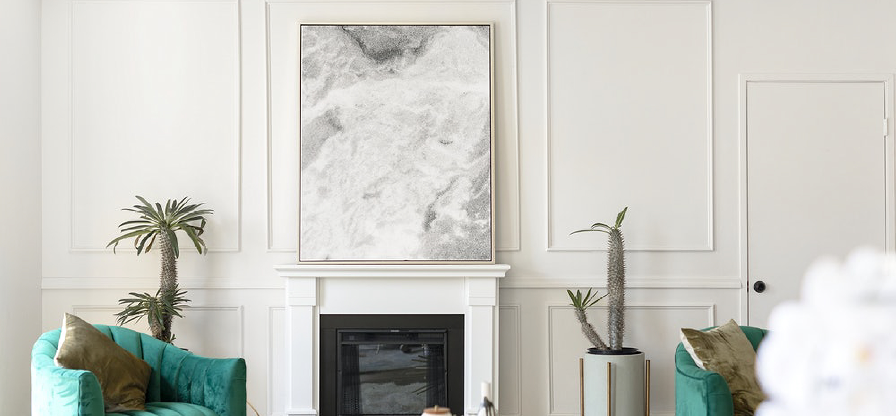

# Re-Art

Getting tired of the same old art on the walls of your home? Use our subscription service to receive a new collection of artwork tailored to your unique taste in art and delivered right to your door, season after season.

## Tech stack

MongoDB, Express, React, Node

## Styling


## Wireframes


## ERDs for database management


## Local Setup

- Install the LTS version of node.js from [here](https://nodejs.org/en/)
- In a terminal, clone this repo

```sh
git clone https://github.com/isaac8069/Re-Art-Client.git
```

- Navigate to the repo folder

```sh
cd Re-Art-Client
```

- Install the project dependencies:

```sh
npm install
```

- Deploy the project on your local machine

```sh
npm start
```

- On your browser, navigate to localhost3000 and the Re-Art project automatically appears on your locally hosted web page. Here are some project screenshots:
<p align="center">  
  
</p>

- Part 2 of local installment includes forking and cloning the server repository, found [here](https://github.com/isaac8069/Re-Art-Server)

## Cloud Deployment

The app is also deployed on Keroku and can be accessed [here](https://nodejs.org/en/)