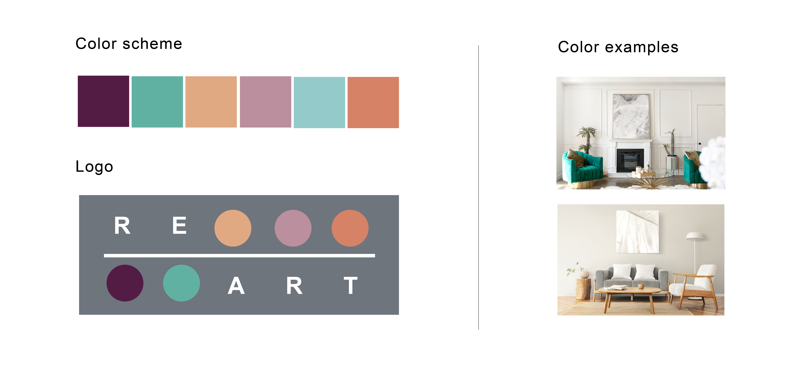
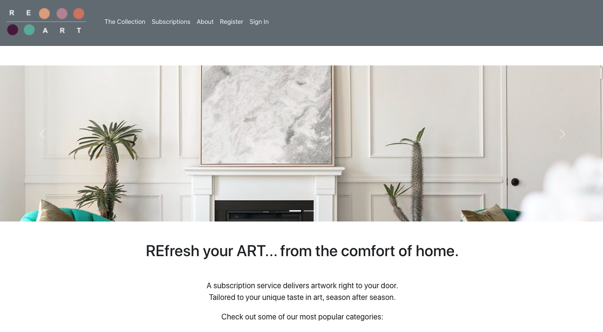

# Re-Art

Getting tired of the same old art on the walls of your home? Use our subscription service to receive a new collection of artwork tailored to your unique taste in art and delivered right to your door, season after season.

## Tech stack

MongoDB, Express, React, Node

## Styling



## User flows

- From the home page:
    - Easily log on or sign up
    - See examples of artwork from the collection
    - Learn about the subscription tiers
- Once logged in:
    - Add artwork tags/keywords to my profile that describe my taste in art
    - Experience a smooth checkout process for my artwork order
    - Edit my profile, including artwork tags/keywords, subscription status, and basic information


## Wireframes


## ERDs for database management


## Daily Sprints

1. ** Day 1: ** 
** Sprint 1 (Friday):**  Planning out features and functionality, developing wireframes, planning data management, create schedule for the week via Trello
** Sprints 2-3 (Saturday/Sunday):** Individual research/review of previously taught materials/documentations to prepare for project week
** Sprint 4 (Monday):** Finalized project details (especially database details, wireframes, CRUD routes), created version 1 of server, continued researching applicable libraries for front end, uploaded initial project files to Github repo, began working on site components
** Sprint 5 (Tuesday):** Continued work on site components (primarily having to do with profile, tags, and subscription), modified server repo as needed, worked on Stripe integration in subscription folder, restructured wireframes (see MVP version above)
** Sprint 6 (Wednesday):** Worked on functionality of creating a new profile and sending data to the db, site homepage styling, data creation, added site redirects to reflect our MVP user flow wireframes
** Sprint 7 (Thursday):** Modified wireframes and user flow to better work with the current code to make sure we would meet MVP on time. Worked on site styling, existing profile and edit profile. Integrated subscription status into user profile, based on successful checkout. Started researching and testing MongoDB data seeding capabilities.
** Sprint 8 (Friday):** Continued debugging the subscription status in user profile and were able to successfully debug once the edit profile was completely functional. Ran into quite a few git issues later in the day and spent time troubleshooting our branches and main. Site styling continued and adjustments were made for smooth user flows and navigational needs. MVP technically functioning using local database after filtered art page was carefully merged into master.
** Sprint 9-10 (Saturday/Sunday):** Final styling, seeding data


## Local Setup

- Install the LTS version of node.js from [here](https://nodejs.org/en/)
- In a terminal, clone this repo

```sh
git clone https://github.com/isaac8069/Re-Art-Client.git
```

- Navigate to the repo folder

```sh
cd Re-Art-Client
```

- Install the project dependencies:

```sh
npm install
```

- Deploy the project on your local machine

```sh
npm start
```

- On your browser, navigate to localhost3000 and the Re-Art project automatically appears on your locally hosted web page. Here are some project screenshots:
<p align="center">  
  
</p>

- Part 2 of local installment includes forking and cloning the server repository, found [here](https://github.com/isaac8069/Re-Art-Server)

## Cloud Deployment

The app is also deployed on Heroku and can be accessed [here](https://nodejs.org/en/)

## Contributors

- [Mackenzie Miller](https://github.com/Mackmiller) (Project Manager) - Fullstack Development, UX/UI
- [Isaac Newman](https://github.com/isaac8069) (Git Manager) - Frontend Development, UX/UI
- [Isaac Waggoner](https://github.com/iwaggoner) - Fullstack Development
- [Michael Kohlberg](https://github.com/mgkdn9) - Fullstack Development